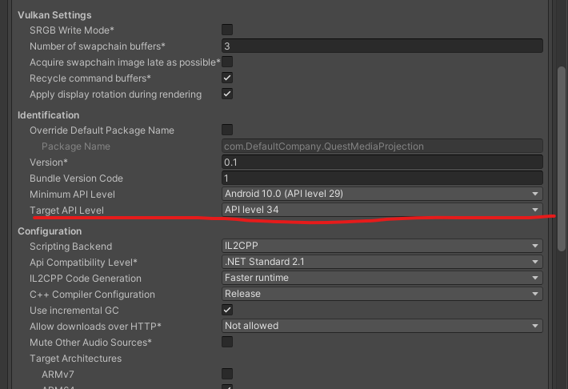
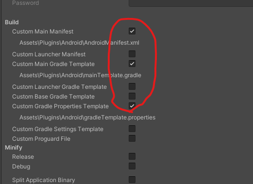
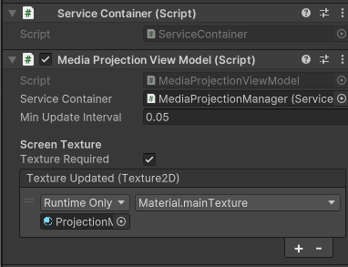
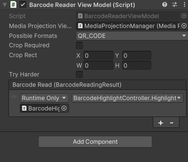
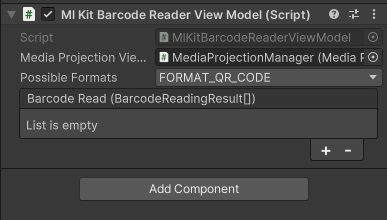
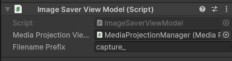

# **Quest Media Projection Plugin for Unity**  

`Quest Media Projection Plugin for Unity` is a Unity plugin for capturing the Meta Quest screen using the MediaProjection API. This plugin provides four main features:  

1. **Capture Screen as Texture2D**: Capture the Meta Quest screen and handle it as a `Texture2D` in Unity.  
2. **Barcode Scanning**: Read specified barcodes from the captured screen using ZXing.  
3. **Save Screen Captures**: Save the captured screen to storage.  
4. 🚀 **WebRTC Support (NEW in v1.3.0!)** 🚀 – Stream captured screen content in **real-time** using WebRTC for seamless remote viewing and communication.  

## YouTube
<div align="left">
  <a href="https://www.youtube.com/watch?v=cM_gVy-KmuM"></a>
</div>
<div align="left">
  <a href="https://www.youtube.com/watch?v=RuTvhjlL4pQ"></a>
</div>

## Device Preparation

### 1. **Firmware Version**
Ensure that your Meta Quest device is running **firmware v68 or later**.  
Media Projection functionality was re-enabled starting with **firmware v68**, so earlier versions may not work as expected.

### 2. **App Permissions - Spatial Data**  
Make sure to enable the **Spatial Data** permission for the app to function correctly.  
To do this:
  1. Open **Settings** on your Quest device.
  2. Navigate to **Apps > App Permissions**.
  3. Find your app and ensure **Spatial Data** is enabled.

*(Thanks to [anagpuyol](https://github.com/t-34400/QuestMediaProjection/issues/2#issuecomment-2677194000) for pointing this out!)*  

## Installation

1. **Create a Meta Quest Project**:  
   - If using the **Meta SDK**, refer to the official tutorials:  
     - [Hello World](https://developers.meta.com/horizon/documentation/unity/unity-tutorial-hello-vr)  
     - [Passthrough Starter Guide](https://developers.meta.com/horizon/documentation/unity/unity-passthrough-gs)  
   - If using **OpenXR**, refer to the OpenXR implementation at:  
     - [QuestMediaProjection-OpenXR](https://github.com/t-34400/QuestMediaProjection-OpenXR)  

2. **Download and Import UnityPackage**:
   - Download the UnityPackage from the [GitHub Releases](https://github.com/t-34400/QuestMediaProjection/releases) page.
   - Import the `.unitypackage` into your Unity project.

3. **Configure Project Settings**:
   - Go to the menu bar and select `Edit > Project Settings`.
   - In the window that appears, go to the `Player` tab and configure the following:
     - In the `Other Settings` panel, set the `Target API Level` to 34 or higher.
     - In the `Publishing Settings`, check the boxes for `Custom Main Manifest`, `Custom Main Gradle Template`, and `Custom Gradle Properties Template`.
     <p float="left">
     
     
     </p>
    
  - If you have enabled `Minify` in the Publishing Settings, you will need to check the `Custom Proguard File` option.

4. **Modify AndroidManifest.xml**:  
   - Open `Assets/Plugins/Android/AndroidManifest.xml`.  
   - Add the following permission inside the `<manifest>` tag:  
     ```xml
     <manifest ...>
         <uses-permission android:name="android.permission.FOREGROUND_SERVICE" />
         <uses-permission android:name="android.permission.FOREGROUND_SERVICE_MEDIA_PROJECTION" />
         ...
     </manifest>
     ```
   - Add the following service definition inside the `<application>` tag:  
     ```xml
     <application ...>
        <service
            android:name="com.t34400.mediaprojectionlib.core.MediaProjectionService"
            android:foregroundServiceType="mediaProjection"
            android:stopWithTask="true"
            android:exported="false" />
        ...
     </application>
     ```
   - **Note:** In **Unity 6+**, you need to **remove the `UnityPlayerActivity` block** from the manifest to avoid conflicts.  
     If your project is using **GameActivity**, keep the `UnityPlayerGameActivity` block and remove the `UnityPlayerActivity` block:  
     ```xml
     <!-- Remove this block if using GameActivity -->
     <activity android:name="com.unity3d.player.UnityPlayerActivity" ...>
         ...
     </activity>

     <!-- Keep this block if using GameActivity -->
     <activity android:name="com.unity3d.player.UnityPlayerGameActivity" ...>
         ...
     </activity>
     ```

5. **Update gradleTemplate.properties**:
   - Open `Assets/Plugins/Android/gradleTemplate.properties`.
   - Add the following lines:
     ```
     android.useAndroidX=true
     android.enableJetifier=true
     ```

6. **Update mainTemplate.gradle**:
   - Open `Assets/Plugins/Android/mainTemplate.gradle`.
   - Add the appropriate dependencies in the `dependencies` scope:
     ```groovy
     dependencies {
        ...
        implementation 'androidx.appcompat:appcompat:1.6.1'
        implementation 'org.jetbrains.kotlinx:kotlinx-serialization-json:1.7.2'

        implementation 'com.google.zxing:core:3.5.3'  // Use this if you are using ZXing for barcode scanning

        implementation 'com.google.mlkit:barcode-scanning:17.3.0'  // Use this if you are using Google ML Kit for barcode scanning
     }
     ```

7. **Update proguard-user.txt**:
  - If you have enabled Minify in the Publishing Settings you need to add the following line to the generated `Assets/Plugins/Android/proguard-user.txt` by enabling the `Custom Proguard File` option 
    ```txt
    -keep class com.t34400.mediaprojectionlib.** { *; }
    ```
    (Thank you to [stephanmitph](https://github.com/t-34400/QuestMediaProjection/issues/5) for pointing out!)

## Usage

### Basic Setup

1. Add the `ServiceContainer` component and `MediaProjectionViewModel` component to a suitable `GameObject`.
2. In the `MediaProjectionViewModel` component, set the `ServiceContainer` field to the previously added `ServiceContainer` component.
3. Adjust the screen capture frequency using the `Min Update Interval [s]` field.
4. Proceed to configure any of the following features as needed.
<p float="left">

</p>

### Capturing Screen as Texture2D

1. In the `MediaProjectionViewModel` component, check the `Texture Required` option.
2. Assign the object that will use the texture to the `Texture Updated` event and select the property/method from the dropdown.
   - If you want to process the texture in a custom component, define a public method like the following, attach it to a `GameObject`, register it with the event, and select the method from the dropdown:
     ```csharp
     using UnityEngine;

     class TextureHandler : MonoBehaviour
     {
         public void ProcessTexture(Texture2D texture)
         {
             // process texture...
         }
     }
     ```
   - If you want to apply the texture to a material, attach the material and select `mainTexture` from the dropdown.

### Reading Barcodes with Zxing

1. Add the `BarcodeReaderViewModel` component to a suitable `GameObject` and attach the `MediaProjectionViewModel` component created in the basic setup to its `MediaProjectionViewModel` field.
2. Select the barcodes to be read from the `PossibleFormats` list (multiple formats can be selected). 
    <details><summary>Supported barcode formats:</summary>

    - `AZTEC`
    - `CODABAR`
    - `CODE_128`
    - `CODE_39`
    - `CODE_93`
    - `DATA_MATRIX`
    - `EAN_13`
    - `EAN_8`
    - `ITF`
    - `MAXICODE`
    - `PDF_417`
    - `QR_CODE`
    - `RSS_14`
    - `RSS_EXPANDED`
    - `UPC_A`
    - `UPC_E`
    - `UPC_EAN_EXTENSION`
    </details>
3. To crop the input image before barcode reading, check `Crop Required` and specify the `Crop Rect`.
4. For higher accuracy, check `Try Harder`.
5. To handle barcode reading results, create a component and register it with the `Barcode Read` event. You need to define a public method in your component that takes an array of `BarcodeReadingResult[]` as an argument:
   ```csharp
   using UnityEngine;
   using MediaProjection.Models;

   class ResultHandler : MonoBehaviour
   {
       public void ProcessResult(BarcodeReadingResult[] results)
       {
           foreach (var result in results)
           {
              　string text = result.Text; // raw text encoded by the barcode
              　string format = result.Format; // format of the barcode that was decoded
              　byte[] rawBytes = result.RawBytes; // raw bytes encoded by the barcode
              　Vector2[] resultPoints = result.ResultPoints; // points related to the barcode in the image
              　long timestamp = result.Timestamp;
              　
              　// ...
           }
       }
   }
   ```
<p float="left">

</p>

### Reading Barcodes with Google MLKit

1. Add the `MlKitBarcodeReaderViewModel` component to a suitable `GameObject` and attach the `MediaProjectionViewModel` component created in the basic setup to its `MediaProjectionViewModel` field.
2. Select the barcodes to be read from the `PossibleFormats` list (multiple formats can be selected). 
    <details><summary>Supported barcode formats:</summary>

    - `CODE_128`
    - `CODE_39`
    - `CODE_93`
    - `CODABAR`
    - `DATA_MATRIX`
    - `EAN_13`
    - `EAN_8`
    - `ITF`
    - `QR_CODE`
    - `UPC_A`
    - `UPC_E`
    - `PDF417`
    - `AZTEC`
    </details>
3. To handle barcode reading results, create a component and register it with the `Barcode Read` event. Similar to ZXing, you need to define a public method in your component that takes an array of `BarcodeReadingResult[]` as an argument.
<p float="left">

</p>

### Saving Captures

1. Add the `ImageSaverViewModel` component to a suitable `GameObject` and attach the `MediaProjectionViewModel` component created in the basic setup to its `MediaProjectionViewModel` field.
2. Specify a filename prefix in the `FilenamePrefix` field.
3. The captured images will be saved to `/sdcard/Android/data/<package name>/files/<FilenamePrefix><timestamp>.jpg`.
<p float="left">

</p>

## Note
- **To enable/disable MediaProjection:**  
  Simply set `ServiceContainer.enabled` to `true` or `false`.  
  - **Important Limitation:**  
    - `MediaProjection` does not support a built-in pause/resume feature.  
    - If you disable it, you will need to request user permission again to restart the projection.  
  - **If you only want to pause Unity-side processing** while keeping `MediaProjection` active, set `enabled = false` on the corresponding `ViewModel` instead.  

## **WebRTC Support** (Optional)  
<details>  
<summary>Click to expand</summary>  

### **Installation**  
1. Complete the **MediaProjection** installation steps.  
2. Add the following dependency to `Assets/Plugins/Android/mainTemplate.gradle`:  
   ```gradle
   implementation 'io.getstream:stream-webrtc-android:1.3.8'
   ```
3. If using microphone audio, add the following permission to `AndroidManifest.xml`:  
   ```xml
   <uses-permission android:name="android.permission.RECORD_AUDIO"/>
   ```

### **Usage**  
1. Add the **ServiceContainer** component to your scene and enable the **Enable WebRTC** option.  
   - If only using WebRTC, disable **Enable Image Processing**.  
2. Add the **WebRtc Media Projection Manager** component to your scene and attach the previously added **ServiceContainer** component.  
3. From any script, call `WebRtcMediaProjectionManager.CreatePeerConnection()` to create a PeerConnection and handle signaling.  

### **API Reference**  
This library is a wrapper around the **[native WebRTC library](https://getstream.github.io/webrtc-android/index.html)**, so refer to its documentation for more details.  

#### **class PeerConnection**  
**Methods:**  
```csharp
void CreateOffer(SdpObserver observer, Dictionary<string, string> constraints)
void CreateAnswer(SdpObserver observer, Dictionary<string, string> constraints)
string GetLocalDescription()
void GetRemoteDescription(SdpObserver observer)
void SetLocalDescription(SdpObserver observer)
void SetLocalDescription(SdpObserver observer, SessionDescriptionType type, string description)
void SetRemoteDescription(SdpObserver observer, string type, string description)
bool AddIceCandidate(string sdpMid, int sdpMLineIndex, string sdp)
void RestartIce()
PeerConnectionState GetConnectionState()
IceConnectionState GetIceConnectionState()
IceGatheringState GetIceGatheringState()
SignalingState GetSignalingState()
void SetAudioPlayout(bool enable)
void SetAudioRecording(bool enable)
void SetBitrate(int min, int current, int max)
```
**Events:**  
```csharp
event Action? OnVideoTrackAdded
event Action<SignalingState>? OnSignalingChange
event Action<IceConnectionState>? OnIceConnectionChange
event Action<bool>? OnIceConnectionReceivingChange
event Action<IceGatheringState>? OnIceGatheringChange
event Action<IceCandidateData>? OnIceCandidate
event Action? OnRenegotiationNeeded
```

#### **class SdpObserver**  
**Constructor:**  
```csharp
SdpObserver()
```
**Events:**  
```csharp
event Action<SessionDescription>? OnCreateSuccess;
event Action? OnSetSuccess;
event Action<string>? OnCreateFailure;
event Action<string>? OnSetFailure;
```

### **Note**  
- **Signaling** must be performed **after** enabling the `ServiceContainer`.  
- If `ServiceContainer` is disabled, a new `PeerConnection` must be created.  
- **Video and audio tracks** are automatically configured.  
- If your script is inside an Assembly Definition, you need to add MediaProjection.WebRTC to its references in order to use WebRTC features.
</details>  

## AAR Source Code
[MediaProjectionLib](https://github.com/t-34400/MediaProjectionLib)

## **Acknowledgements**
This project uses the following libraries:

- [ZXing](https://github.com/zxing/zxing), licensed under the [Apache License 2.0](https://opensource.org/licenses/Apache-2.0).  
- [ML Kit](https://developers.google.com/ml-kit), subject to the [ML Kit Terms of Service](https://developers.google.com/ml-kit/terms).  
- [WebRTC Android by Stream](https://github.com/GetStream/webrtc-android?tab=readme-ov-file), licensed under the [Apache License 2.0](https://github.com/GetStream/webrtc-android/blob/main/LICENSE).  
- [NativeWebSocket](https://github.com/endel/NativeWebSocket), licensed under the [MIT License](https://github.com/endel/NativeWebSocket/blob/master/LICENSE).  

We would like to thank the contributors of these libraries for their work.

## **License**  
This project is licensed under the [MIT License](LICENSE).  

If you include the following libraries as dependencies in your Unity project, please ensure compliance with their respective licenses:  

- **[ZXing](https://github.com/zxing/zxing)** – [Apache License 2.0](https://opensource.org/licenses/Apache-2.0)  
- **[ML Kit](https://developers.google.com/ml-kit)** – [ML Kit Terms of Service](https://developers.google.com/ml-kit/terms)  
- **[WebRTC Android by Stream](https://github.com/GetStream/webrtc-android?tab=readme-ov-file)** – [Apache License 2.0](https://github.com/GetStream/webrtc-android/blob/main/LICENSE)  

Make sure to review and adhere to the licensing terms of these libraries when integrating them into your project.  
